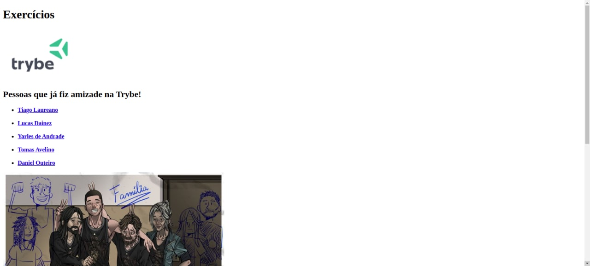

## HTML & CSS - Estruturas de página

### Fui capaz de:
- Estruturar páginas web com HTML utilizando as tags `html`, `head` e `body`;
- Utilizar o HTML para estruturar textos e títulos;
- Utilizar o HTML para criar listas, _links_ e adicionar imagens;

### Exercício:

`index.html`

~~~html
<!DOCTYPE html>
<html lang="pt-br">
  <head>
    <meta charset="UTF-8">
    <title>HTML</title>
  </head>
  <body>
    <h1>Exercícios</h1>
  </body>
</html>
~~~

#### HTML - Primeiras tags

1 - Crie uma lista das pessoas que você já fez amizade na Trybe.

2 - Adicione uma imagem que venha de uma URL externa.

3 - Adicione uma imagem que está no seu computador, local.

#### HTML - Links externos e internos

1 - Crie um parágrafo para cada pessoa da sua lista.

2 - Crie um link entre a sua lista e os parágrafos de pessoas.

3 - Crie um link para a página do Google.