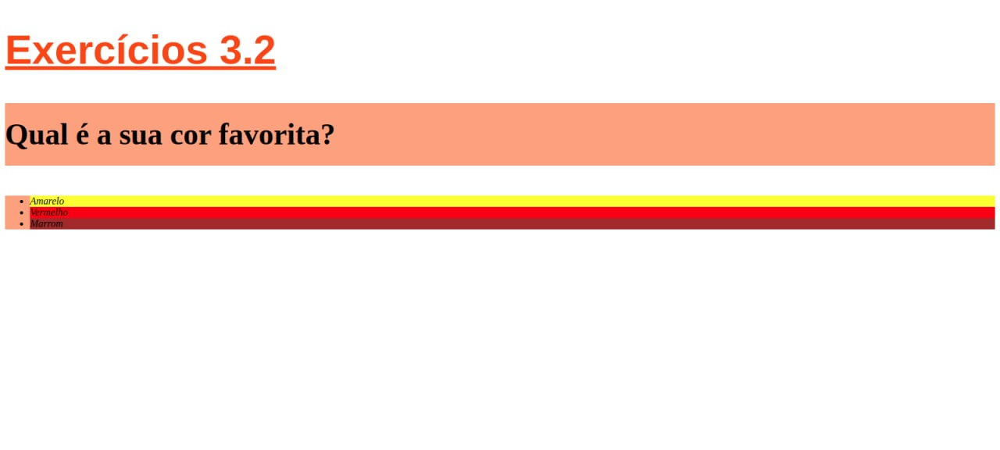

## HTML & CSS - Primeiros passos em CSS

### Fui capaz de:
- Criar regras de estilo para tags HTML utilizando o CSS;
- Utilizar os seletores de `tag`, `id` e `class` para aplicar regras de CSS;
- Alterar características da fonte e das cores de páginas web;
- Utilizar CSS _inline_ e _externo_.

### Exercício:

`index.html`

~~~html
<!DOCTYPE html>
<html lang="pt-br">
  <head>
    <meta charset="UTF-8">
    <title>HTML</title>
    
  </head>
  <body>
    <h1>Exercícios 3.2</h1>
    
Qual é a sua cor favorita?

    <ul>
      <li>Amarelo</li>
      <li>Vermelho</li>
      <li>Marrom</li>
    </ul>
  </body>
</html>
~~~

### Introdução ao CSS

1 - Modifique o tamanho do h1 para 65 pixels

2 - Modifique a cor do texto do h1 para laranja

3 - Modifique a cor de fundo da lista não ordenada

4 - Crie uma classe para modificar a cor de fundo da tag p e da ul ao mesmo tempo

### Propriedades de texto no CSS

1 - Modifique a família do h1 para sans-serif

2 - Deixe o parágrafo com o font-weight 600

3 - Modifique o font-size do body para 16px

4 - Coloque o tamanho do parágrafo com o tamanho de 3 vezes o padrão do body

5 - Explore as propriedades font-style, line-height, text-align e text-decoration

6 - Troque a cor de fundo de cada item da lista para a cor correspondente ao texto

### CSS inline e externo

1 - Coloque todo o CSS criado até agora nos exercícios anteriores em um arquivo externo.
