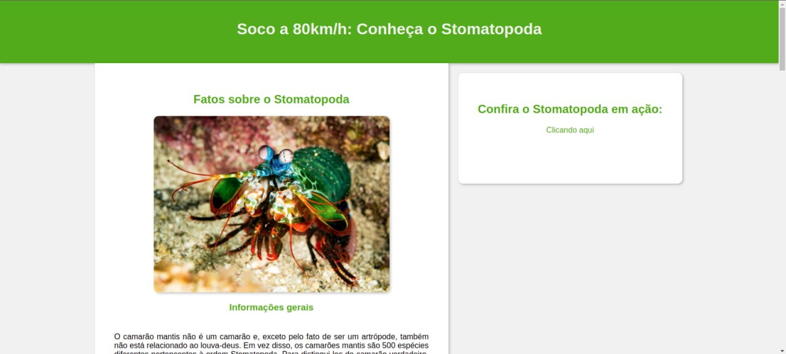

## Agora a prática

`index.html`

~~~html
<!DOCTYPE html>
<html>
  <head>
    <meta charset="UTF-8" />
    <meta name="viewport" content="width=device-width" />
  </head>
  <body>
    <!--insira os elementos aqui-->
  </body>
</html>
~~~

O objetivo desses exercícios é colocar em prática o que você acabou de aprender sobre **HTML semântico**.

Para tal, criaremos uma página que apresenta um dos animais mais impressionantes que existem: o [Stomatopoda](https://www.nationalgeographic.com/science/article/natures-most-amazing-eyes-just-got-a-bit-weirder). A estilização da página fica a seu critério. 😉

Para uma melhor organização, faça commits a cada tarefa concluída. Vamos aos exercícios:
1 - Adicione um cabeçalho na página contendo o título `Soco a 80km/h: Conheça o Stomatopoda`.

2 - Adicione um conjunto de links que representam a área de navegação do site.
  - Crie um link chamado `Página Inicial`.
  - Crie um link chamado `Sobre`.
  - Crie um link chamado `Contato`.

3 - Crie um artigo que vai conter os fatos interessantes sobre o `Stomatopoda`. O artigo terá o subtítulo `Fatos sobre o Stomatopoda`. Segue [um site animal](https://theoatmeal.com/comics/mantis_shrimp) de inspiração para pegar fatos.
4 - Divida o artigo em seções, organizando-o da seguinte forma:

  - Uma primeira seção contendo informações gerais a respeito do animal. O subtítulo para essa seção fica a seu critério. É necessário que conste nessa seção seu _nome científico_, que é `Odontodactylus scyllarus`, em itálico. Além disso, é preciso que haja informação tabular a respeito de sua classificação científica, em específico: `Reino`, `Filo`, `Subfilo`, `Classe`, `Subclasse` e `Ordem`. Tais informações você consegue obter na [Wikipedia](https://pt.wikipedia.org/wiki/Stomatopoda).
  - As outras seções dizem respeito aos fatos interessantes que você escolheu acerca do animal. Para cada fato escolhido você vai criar uma seção.
  - Adicione, para cada seção, um subtítulo referente ao fato escolhido.
  - Adicione, para cada seção, parágrafo(s) descrevendo o fato escolhido. Destaque características impressionantes referentes ao fato que você escolheu, de forma a reforçar a unicidade do `Stomatopoda`. Por exemplo: se você criar uma seção detalhando o soco potente do animal, seria interessante destacar a velocidade desse soco (80km/h) em negrito.
  - Adicione, para cada seção, uma imagem, como forma de ilustrar o fato.
  - Adicione, por fim, uma seção de referências bibliográficas, contendo uma lista de todos os links que foram usados como base para compilar a página em questão.

5 - Adicione um conteúdo adjacente ao artigo, disponibilizando um link para [este vídeo](https://www.youtube.com/watch?v=E0Li1k5hGBE), que mostra o animal em ação.

6 - Adicione um rodapé na página, mostrando algo do gênero:

~~~html
"Conteúdo compilado por <insere seu nome>, <ano atual>".
~~~

Obs: para esse exercício, é obrigatório fazer uso de, no mínimo, 6 elementos com as seguintes tags: `header`, `nav`, `article`, `section`, `h1`, `h2`, `h3`, `aside`, `footer`, `table` e `img`.